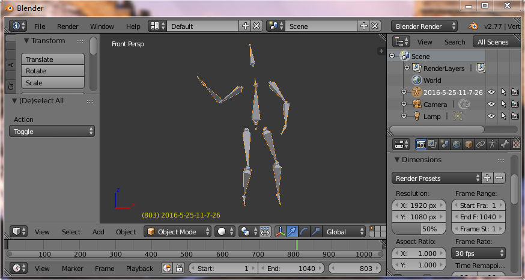
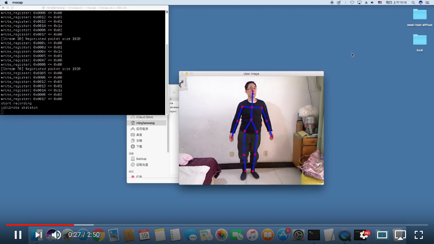
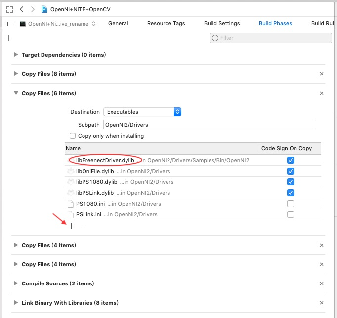

# kinect-openni-bvh-saver
## Note: If you want an enhanced version for Windows platform, go to [http://www.mesh-online.net/mocap.html](http://www.mesh-online.net/mocap.html), the enhanced version can use multiple Kinect sensors for Xbox 360, thus captures true 360-degree range of motions in realtime. 
 
This project is based on OpenNI2, NITE2, and OpenCV2, it will automatically save many skeleton animation clips to bvh files. 
 
Then you can import the bvh files into Blender or other softwares to smooth animation curves. I use Blender's default smooth key setting to smooth all rotation channels, the results is acceptable. 
 
You can turn your body around 360 degrees in this project, I am very satisfied with the result. 
 
Though the project is developed on macOS, you can port it to Linux, Windows easily, for the source code is portable. 
 

Download windows release from: [http://www.mesh-online.net/mocap-windows.zip](http://www.mesh-online.net/mocap-windows.zip) 
 
Linux port hint: 
[Ubuntu Kinect C++ Development Enviroment](https://github.com/suiwenfeng/Ubuntu_x64_Openni2.2_NiTE2.2_FreenectDriver). 
 
Windows port hint: 
1.Download [Kinect for Windows SDK 1.8](https://www.microsoft.com/en-us/download/details.aspx?id=40278), install the SDK. 
2.Download [OpenNI 2 SDK Binaries](https://s3.amazonaws.com/com.occipital.openni/OpenNI-Windows-x86-2.2.0.33.zip), install the SDK. 
3.Download [NiTE-Windows-x86-2.2.zip](https://drive.google.com/file/d/0B3e4_6C5_YOjQWtCcVl3VnRsWG8/edit), install the SDK. 
4.Download [opencv 2.4.11 Win Pack](https://sourceforge.net/projects/opencvlibrary/files/opencv-win/2.4.11/opencv-2.4.11.exe/download), install the SDK to the root of drive C:. 
5.Build the source code with Visual Studio 2010 or Visual Studio Community 2017. 
 
Click the image to watch kinect mocap demo: 

 
### Requirements
macOS 10.11 
kinect for xbox 360 
OpenNI2 
NITE2 
OpenCV2 
Xcode 7.3.1
### How to use
1.Git clone [openni-nite-opencv-xcode](https://github.com/rishadbharucha/openni-nite-opencv-xcode). 
2.Install libpng, OpenNI2, OpenCV2 from source code, via macport or homebrew. 
3.Copy all the source codes to 'openni-nite-opencv-xcode/OpenNI+NITE+OpenCV', and add them to the project. 
4.Copy /usr/local/lib/OpenNI2-FreenectDriver/libFreenectDriver.0.5.0.dylib to 'openni-nite-opencv-xcode/OpenNI2/Drivers/Samples/Bin/OpenNI2/libFreenectDriver.dylib', then add the filename to Xcode's 'Targets->Build Phases->Copy Files(5 items)', ensure that the Subpath is 'OpenNI2/Drivers'. 
 
5.Plug kinect for xbox 360 into USB port. 
6.Open the project, build and run. 
 
Note: If you failed to run, just try again, the Kinect driver for macOS is not stable. 
 
When the Kinect sensor detects your body, the app will start recording, after the Kinect sensor lose your body, the app will stop recording, the BVH files will be saved to '../data'. 
 
Enter the Kinect camera's viewport, perform actions, then leave the viewport. Repeat the above steps, you can record many skeleton animation clips at one time.
### Thanks
1.[Derek Hendrickx's KinectMotionCapture](https://github.com/derekhendrickx/KinectMotionCapture) 
2.[Kyle Weicht's 3D math library](https://github.com/awesomekyle/math) 
3.[Birdy's Notebook](http://bediyap.com/programming/convert-quaternion-to-euler-rotations/) 
4.[sunchy's Kinect_to_BVH_Console](https://github.com/isunchy/Kinect_to_BVH_Console) 
5.[Rishad Bharucha's openni-nite-opencv-xcode](https://github.com/rishadbharucha/openni-nite-opencv-xcode)
### License
The MIT License (MIT)
